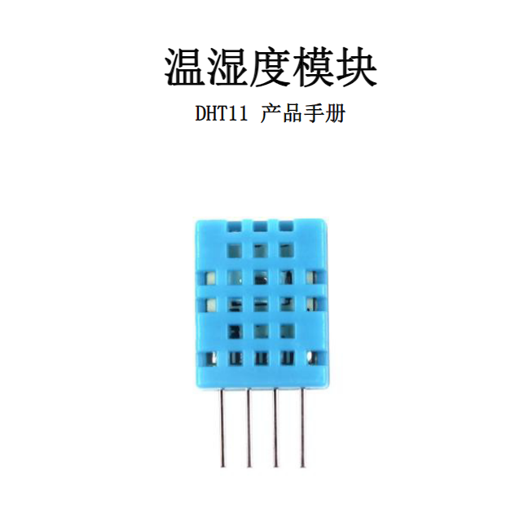
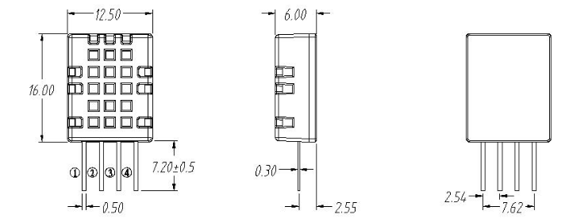
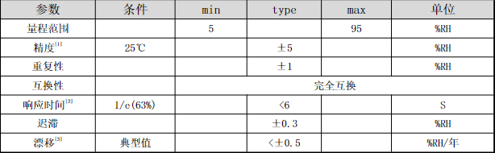
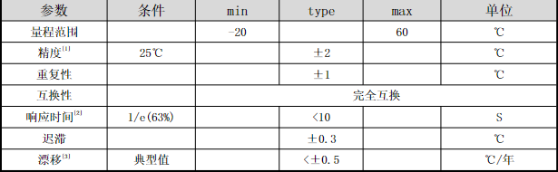
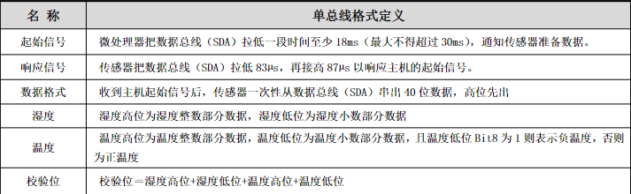
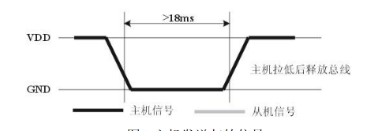
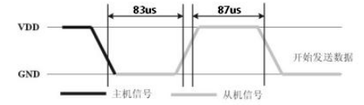
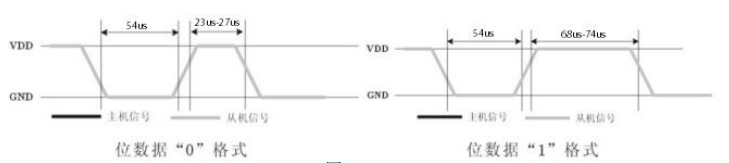

# STM32
物联网综合案例: STM32+DHT11+ESP8266+WCS1800+57步进电机

# x.DHT11(温湿度传感器)

## x.1简介
- DHT11数字温湿度传感器是一款含有已校准数字信号输出的温湿度
复合传感器。它应用专用的数字模块采集技术和温湿度传感技术，确保
- 产品具有极高的可靠性与卓越的长期稳定性。传感器包括一个电容式感湿元件和一个NTC测温元件，并与一个高性能8位单片机相连接。
## x.2产品亮点
- 成本低、长期稳定、相对湿度和温度测量、品质卓越、超快响应、抗干扰能力强、超长的信号传输距离、数字信号输出、精确校准。
## x.3外形尺寸

### x.3.1引脚说明
- VDD: 供电3.3~5.5v
- DATA串行数据, 单总线
- NC: 空引脚
- GND: 接地,电源负极
## x.4产品参数
### x.4.1相对湿度

### x.4.2温度

## x.5串行通信说明(单线双向)

### x.5.1单总线说明
- DHT11器件采用简化的单总线通信。单总线即只有一根数据线，系统中的数据交换、控制
均由单总线完成。设备（主机或从机）通过一个漏极开路或三态端口连至该数据线，以允许
设备在不发送数据时能够释放总线，而让其它设备使用总线；单总线通常要求外接一个约
4.7kΩ的上拉电阻，这样，当总线闲置时，其状态为高电平。由于它们是主从结构，只有主
机呼叫从机时，从机才能应答，因此主机访问器件都必须严格遵循单总线序列，如果出现序列混乱，器件将不响应主机。
### x.5.2单总线传送数据位定义
- DATA用于微处理器与DHT11之间的通讯和同步,采用单总线数据格式，一次传送40位数据，
高位先出。
- 数据格式:  
8bit湿度整数数据+8bit湿度小数数据+8bit温度整数数据+8bit温度小数数据+8bit校验位。
- ***注：其中湿度小数部分为0***
### x.5.3校验位数据定义
“8bit湿度整数数据+8bit湿度小数数据+8bit温度整数数据+8bit温度小数数据”8bit校验位等于所得结果的末8位。
## x.6外设读取步骤(重要)
- 步骤一:
  - DHT11上电后（DHT11上电后要等待1S以越过不稳定状态在此期间不能发送任何指令），测试环境温湿度数据，并记录数据，同时DHT11的DATA数据线由上拉电阻拉高一直保持高电平；此时DHT11的DATA引脚处于输入状态，时刻检测外部信号。
- 步骤二:
  - 微处理器的I/O设置为输出同时输出低电平，且低电平保持时间不能小于18ms（最大不得超过30ms），然后微处理器的I/O设置为输入状态，由于上拉电阻，微处理器的I/O即DHT11的DATA数据线也随之变高，等待DHT11作出回答信号。发送信号如下图所示：
  
- 步骤三: 
  - DHT11的DATA引脚检测到外部信号有低电平时，等待外部信号低电平结束，延迟后DHT11的DATA引脚处于输出状态，输出83微秒的低电平作为应答信号，紧接着输出87微秒的高电平通知外设准备接收数据，微处理器的I/O此时处于输入状态，检测到I/O有低电平（DHT11回应信号）后，等待87微秒的高电平后的数据接收，发送信号如图所示：
  
- 步骤四:
  - 由DHT11的DATA引脚输出40位数据，微处理器根据I/O电平的变化接收40位数据，位数据“0”的格式为：54微秒的低电平和23-27微秒的高电平，位数据“1”的格式为：54微秒的低电平加68-74微秒的高电平。位数据“0”、“1”格式信号如图所示：
  
- 结束信号:
  - DHT11的DATA引脚输出40位数据后，继续输出低电平54微秒后转为输入状态，由于上拉电阻随之变为高电平。但DHT11内部重测环境温湿度数据，并记录数据，等待外部信号的到来。
- 注: 每次读出的温湿度数值是上一次测量的结果，欲获取实时数据,需连续读取2次，但不建议连续多次读取传感器，每次读取传感器间隔大于2秒即可获得准确的数据
## x.7代码实现
[DHT11源代码](./User/DHT11/dht11.c)  
[DHT11头文件代码](./User/DHT11/dht11.h)