# STM32综合案例
&nbsp;&nbsp;&nbsp;&nbsp;&nbsp;&nbsp;&nbsp;&nbsp; 本项目使用STM32F10x作为主控板,使用标准库采集DHT11的温湿度,采集WCS1800的电压,采集编码器的转速,并将数据通过wifi模块上传到华为云平台.文档分为:DHT11+WCS1800+ZT3806-360-N-12-24V增量式编码器+ESP8266/32四部分,每部分从传感器的简介开始,详细介绍了传感器的各种参数,以及如何使用和使用原理,完整Github配套工程代码:(https://github.com/Abrillant-Lee/STM32)(部分代码未校准,可主要参考User目录）
## 1.DHT11温湿度传感器
### 1.1	DHT11简介
&nbsp;&nbsp;&nbsp;&nbsp;&nbsp;&nbsp;&nbsp;&nbsp;DHT11数字温湿度传感器是一款含有已校准数字信号输出的温湿度复合传感器。它应用专用的数字模块采集技术和温湿度传感技术，确保产品具有极高的可靠性与卓越的长期稳定性。传感器包括一个电容式感湿元件和一个NTC测温元件，并与一个高性能8位单片机相连接。
### 1.2 产品亮点
&nbsp;&nbsp;&nbsp;&nbsp;&nbsp;&nbsp;&nbsp;&nbsp;成本低、长期稳定、相对湿度和温度测量、品质卓越、超快响应、抗干扰能力强、超长的信号传输距离、数字信号输出、精确校准。
## 1.3 外形尺寸

### 1.3.1 引脚说明
&nbsp;&nbsp;&nbsp;&nbsp;&nbsp;&nbsp;&nbsp;&nbsp;VDD:供电3.3~5.5v;  
&nbsp;&nbsp;&nbsp;&nbsp;&nbsp;&nbsp;&nbsp;&nbsp;DATA串行数据,单总线;  
&nbsp;&nbsp;&nbsp;&nbsp;&nbsp;&nbsp;&nbsp;&nbsp;NC:空引脚;  
&nbsp;&nbsp;&nbsp;&nbsp;&nbsp;&nbsp;&nbsp;&nbsp;GND:接地,电源负极;  
## 1.4 产品参数
### 1.4.1 相对湿度
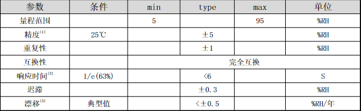
### 1.4.2 相对温度

## 1.5 串行通信说明(单线双向)
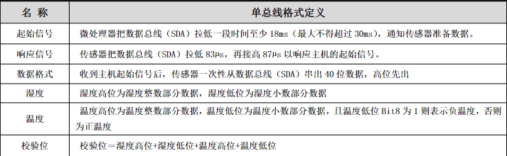 
### 1.5.1 单总线说明
&nbsp;&nbsp;&nbsp;&nbsp;&nbsp;&nbsp;&nbsp;&nbsp;DHT11器件采用简化的单总线通信。单总线即只有一根数据线，系统中的数据交换、控制均由单总线完成。设备（主机或从机）通过一个漏极开路或三态端口连至该数据线，以允许设备在不发送数据时能够释放总线，而让其它设备使用总线；单总线通常要求外接一个约4.7kΩ的上拉电阻，这样，当总线闲置时，其状态为高电平。由于它们是主从结构，只有主机呼叫从机时，从机才能应答，因此主机访问器件都必须严格遵循单总线序列，如果出现序列混乱，器件将不响应主机
### 1.5.2 单总线传送数据位定义
&nbsp;&nbsp;&nbsp;&nbsp;&nbsp;&nbsp;&nbsp;&nbsp;DATA用于微处理器与DHT11之间的通讯和同步,采用单总线数据格式，一次传送40位数据，高位先出。 
&nbsp;&nbsp;&nbsp;&nbsp;&nbsp;&nbsp;&nbsp;&nbsp;-数据格式: 
&nbsp;&nbsp;&nbsp;&nbsp;&nbsp;&nbsp;&nbsp;&nbsp;8bit湿度整数数据+8bit湿度小数数据+8bit温度整数数据+8bit温度小数数据+8bit校验位 
&nbsp;&nbsp;&nbsp;&nbsp;&nbsp;&nbsp;&nbsp;&nbsp;注：其中湿度小数部分为0
### 1.5.3 校验位数据定义
&nbsp;&nbsp;&nbsp;&nbsp;&nbsp;&nbsp;&nbsp;&nbsp;“8bit湿度整数数据+8bit湿度小数数据+8bit温度整数数据+8bit温度小数数据”8bit校验位等于所得结果的末8位。
## 1.6 外设读取步骤(重要)
### 1.6.1 步骤一:
&nbsp;&nbsp;&nbsp;&nbsp;&nbsp;&nbsp;&nbsp;&nbsp;DHT11上电后（DHT11上电后要等待1S以越过不稳定状态在此期间不能发送任何指令），测试环境温湿度数据，并记录数据，同时DHT11的DATA数据线由上拉电阻拉高一直保持高电平；此时DHT11的DATA引脚处于输入状态，时刻检测外部信号。
### 1.6.2 步骤二:
&nbsp;&nbsp;&nbsp;&nbsp;&nbsp;&nbsp;&nbsp;&nbsp;微处理器的I/O设置为输出同时输出低电平，且低电平保持时间不能小于18ms（最大不得超过30ms），然后微处理器的I/O设置为输入状态，由于上拉电阻，微处理器的I/O即DHT11的DATA数据线也随之变高，等待DHT11作出回答信号。发送信号如下图所示：
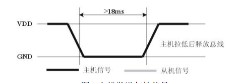 
### 1.6.3 步骤三: 
&nbsp;&nbsp;&nbsp;&nbsp;&nbsp;&nbsp;&nbsp;&nbsp;DHT11的DATA引脚检测到外部信号有低电平时，等待外部信号低电平结束，延迟后DHT11的DATA引脚处于输出状态，输出83微秒的低电平作为应答信号，紧接着输出87微秒的高电平通知外设准备接收数据，微处理器的I/O此时处于输入状态，检测到I/O有低电平（DHT11回应信号）后，等待87微秒的高电平后的数据接收，发送信号如图所示：
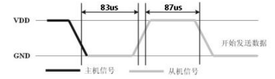 
### 1.6.4 步骤四:
&nbsp;&nbsp;&nbsp;&nbsp;&nbsp;&nbsp;&nbsp;&nbsp;由DHT11的DATA引脚输出40位数据，微处理器根据I/O电平的变化接收40位数据，位数据“0”的格式为：54微秒的低电平和23-27微秒的高电平，位数据“1”的格式为：54微秒的低电平加68-74微秒的高电平。位数据“0”、“1”格式信号如图所示：
 
### 1.6.5 结束信号:
&nbsp;&nbsp;&nbsp;&nbsp;&nbsp;&nbsp;&nbsp;&nbsp;DHT11的DATA引脚输出40位数据后，继续输出低电平54微秒后转为输入状态，由于上拉电阻随之变为高电平。但DHT11内部重测环境温湿度数据，并记录数据，等待外部信号的到来。
&nbsp;&nbsp;&nbsp;&nbsp;&nbsp;&nbsp;&nbsp;&nbsp;注: 每次读出的温湿度数值是上一次测量的结果，欲获取实时数据,需连续读取2次，但不建议连续多次读取传感器，每次读取传感器间隔大于2秒即可获得准确的数据
## 1.7 DHT11获取温湿度实验
### 1.7.1硬件设计
&nbsp;&nbsp;&nbsp;&nbsp;&nbsp;&nbsp;&nbsp;&nbsp;为实现STM32获取DHT11温湿度传感器数据并将数据打印在串口上,后续上传到华为云平台,需要准备STM32VET6+DHT11+USB转TTL.
|            STM32VET6            | DHT11 |  UBS转TTL   |
| :-----------------------------: | :---: | :---------: |
|              3.3v               |  VCC  | 可接/可不接 |
|               GND               |  GND  |     GND     |
| GPIOE6(可改宏定义进行改变)	DATA |  无   |
|               PA9               |  无   |     RXD     |
|              PA10               |  无   |     TXD     |

### 1.7.2软件设计
&nbsp;&nbsp;&nbsp;&nbsp;&nbsp;&nbsp;&nbsp;&nbsp;写程序时对照着1.6外设读取步骤配置,这里只放核心的部分代码,代码里有详细的注释,看注释即可明白,有些简单函数的说明,变量的设置,头文件的包含等并没有涉及到,完整的代码请参考Github配套的工程。
 
- 图1-8 DHT11读取一个字节函数 
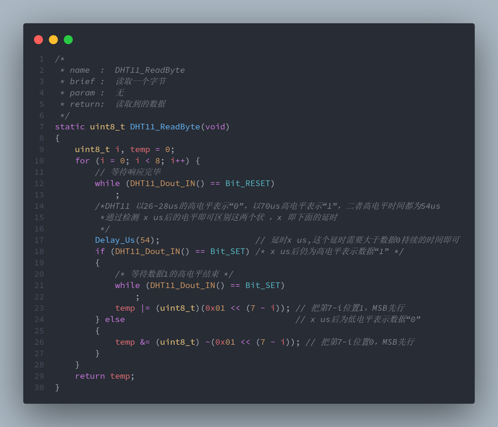
- 图1-9 读取温湿度函数
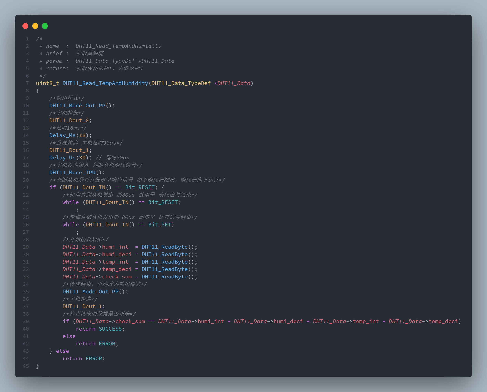

# 2.电流互感器/WCS1800霍尔电流传感器
## 2.1 WCS1800简介
### 2.1.1 功能说明
&nbsp;&nbsp;&nbsp;&nbsp;&nbsp;&nbsp;&nbsp;&nbsp;WCS 1800霍尔电流传感器主要有两个功能，第一个功能是经过运放跟随的模拟信号，适用于A/D转换；第二个功能是开关信号，可预先设定限流值，当实际电流值大于预先设定电流值时，开关信号会由低电平变为高电平，并有发光二极管指示灯指示.我们使用第一个功能:WCS1800由一个带温度补偿电路的精密低温漂线性霍尔传感器IC和一个直径为9.0毫米的通孔组成。我们可以使用系统自带的电线穿过这个孔来测量通过的电流。
### 2.1.2 外形尺寸
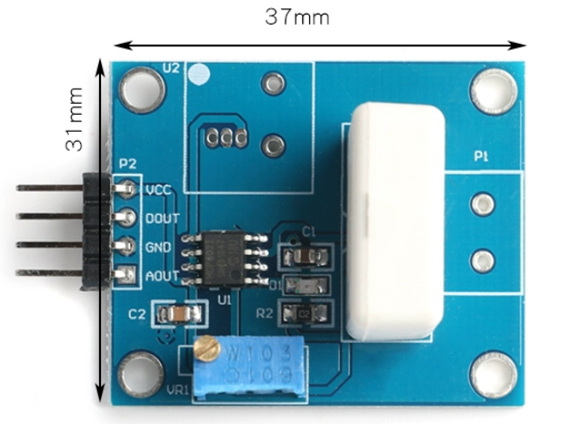 
### 2.1.3 引脚说明
&nbsp;&nbsp;&nbsp;&nbsp;&nbsp;&nbsp;&nbsp;&nbsp;VCC:电源正极; 
&nbsp;&nbsp;&nbsp;&nbsp;&nbsp;&nbsp;&nbsp;&nbsp;DOUT:TTL高/低电平信号输出; 
&nbsp;&nbsp;&nbsp;&nbsp;&nbsp;&nbsp;&nbsp;&nbsp; GND:电源负极; 
&nbsp;&nbsp;&nbsp;&nbsp;&nbsp;&nbsp;&nbsp;&nbsp;AOUT:采样电流信号转换电压输出端; 
### 2.1.4功能特点
&nbsp;&nbsp;&nbsp;&nbsp;&nbsp;&nbsp;&nbsp;&nbsp;1、工作电压：直流DC5V; 
&nbsp;&nbsp;&nbsp;&nbsp;&nbsp;&nbsp;&nbsp;&nbsp;2、电流检测范围:DC：±35A；AC：25A（适用于模拟输出）； 
&nbsp;&nbsp;&nbsp;&nbsp;&nbsp;&nbsp;&nbsp;&nbsp;3、线性度：K=60mV/A； 
&nbsp;&nbsp;&nbsp;&nbsp;&nbsp;&nbsp;&nbsp;&nbsp;4、可限流电流范围：0.5A--35A（适用于开关量输出）; 
&nbsp;&nbsp;&nbsp;&nbsp;&nbsp;&nbsp;&nbsp;&nbsp;5、带过流信号指示灯; 
&nbsp;&nbsp;&nbsp;&nbsp;&nbsp;&nbsp;&nbsp;&nbsp;6、带安装孔，方便固件安装； 
&nbsp;&nbsp;&nbsp;&nbsp;&nbsp;&nbsp;&nbsp;&nbsp;7、采样电流转换模拟电压信号输出，可接ADC；TTL电平信号输出，可接单片机IO口控制。 
8、输出信号为：模拟电压信号与开关量信号。 
### 2.1.5 电气特性
 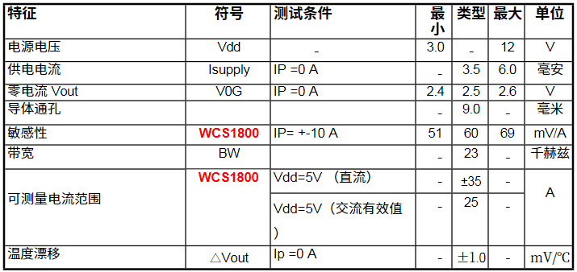
### 2.1.6 模拟电压信号输出（AOUT）使用说明
&nbsp;&nbsp;&nbsp;&nbsp;&nbsp;&nbsp;&nbsp;&nbsp;检测电流与模拟信号输出的关系如下：
模拟信号输出：V0=Vcc2 ±Ia*K(其中Ia电流	检测脚实际流过的电流，K为线性度)；
以输入电流1A为例，Vcc=5V，WCS1800的线性度是60mV/A；
我们简单说下WCS1800检测电流与输出电压的对应关系
电流从正方向流进时：
公式V0=Vcc2 + Ia*K，对应输出：V0=(2.5+0.06)V=2.56V
电流从反方向流进时：
公式V0=Vcc2 - Ia*K，对应输出：V0=(2.5-0.06)V=2.44V
如果是交流信号时：V0=Vcc2 + Ia*K，V0对应输出范围：2.44V-2.56V
以上为理想数值，实际数值会有一定微小精度误差。
### 2.1.7 开关量输出（DOUT）使用说明
&nbsp;&nbsp;&nbsp;&nbsp;&nbsp;&nbsp;&nbsp;&nbsp;假如在一个电路中，如果电流高于1A，要求此模块输出一个高电平：
- 步骤一：把检测端的一条导线穿过传感器的圆孔（注意此时电流从正向流进）,然后开通电源，把检测端的电流调到1A状态，逆时钟拧动可调电阻Vref，一直拧到红色LED亮的时刻即好，（LED由不亮到亮的转换点即好，就不要拧了）。此时Vref>Vo.
- 步骤二：以上限流1A电流的设置就已经完成了。撤掉1A的电流，LED亮，
- 步骤三：以后当被检测端的电流超过1A时，红色LED不亮，此时模块Dout输出高电平。
## 2.2 WCS1800获取电压实验
### 2.2.1 硬件设计
&nbsp;&nbsp;&nbsp;&nbsp;&nbsp;&nbsp;&nbsp;&nbsp;需要准备STM32F103VET6+WCS1800+USB转TTL,USB转TTL接线和DHT11一样,这里表格不再描述
|       STM32F103VET6        | WCS1800 |
| :------------------------: | :-----: |
|             5V             |   VCC   |
|            GND             |   GND   |
| GPIOA0(可根据实际情况更改) |  AOUT   |
|             无             |  BOUT   |

### 2.2.2 软件设计(未校准)
&nbsp;&nbsp;&nbsp;&nbsp;&nbsp;&nbsp;&nbsp;&nbsp;软件设计主要ADC的配置,代码里有详细的注释,看注释即可明白,有些简单函数的说明,变量的设置,头文件的包含等并没有涉及到,完整的代码请参考Github配套的工程。
 

# 3.编码器
## 3.1 简介
&nbsp;&nbsp;&nbsp;&nbsp;&nbsp;&nbsp;&nbsp;&nbsp;增量式旋转编码器是将设备运动时的位移信息变成连续的脉冲信号，脉冲个数表示位移量的大小。只有当设备运动的时候增量式编码器才会输出信号。 编码器一般会把这些信号分为通道A和通道B两组输出，并且这两组信号间有90°的相位差。同时采集这两组信号就可以知道设备的运动和方向。增量式编码器只输出设备的位置变化和运动方向，不会输出设备的绝对位置。
### 3.1.1 外形尺寸
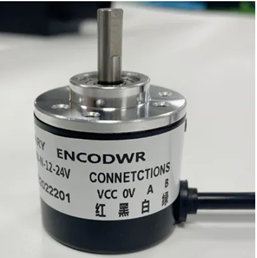 
### 3.2 增量式编码器原理
&nbsp;&nbsp;&nbsp;&nbsp;&nbsp;&nbsp;&nbsp;&nbsp;增量式编码器都有A、B两通道信号输出，这是因为增量式编码器的码盘上有两圈线槽， 两圈线槽的之间会错开一定的角度，这个角度会使得光电检测装置输出的两相信号相差 1/4 周期(90°)。码盘的具体工作方式如下图所示。 图中黑色代表透光，白色代表遮光。当码盘转动时，内圈和外圈的线槽会依次透过光线，光电检测装置检测到光线通断的变化， 就会相应的输出脉冲信号，因为内外圈遮光和透光时候存在时间差，所以也就有了A、B两通道信号的相位差。
 
- 图3-1 增量式编码器码盘运动方式一 
  
图3-2 增量式编码器码盘运动方式二 
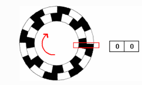  
图4-3 增量式编码器码盘运动方式三 
  
 
&nbsp;&nbsp;&nbsp;&nbsp;&nbsp;&nbsp;&nbsp;&nbsp;根据两相信号变化的先后顺序就可以判断运动方向，记录输出的脉冲个数可以知道位移量的大小，同时通过输出信号的频率就能得到速度。
## 3.3 增量式编码器测速方法
&nbsp;&nbsp;&nbsp;&nbsp;&nbsp;&nbsp;&nbsp;&nbsp;对于电机转速的测量，可以把增量式编码器安装到电机上，用控制器对编码器脉冲进行计数，然后通过特定的方法求出电机转速，常用的编码器测速方法一般有三种：M法、T法和M/T法。
### 3.3.1 M法
&nbsp;&nbsp;&nbsp;&nbsp;&nbsp;&nbsp;&nbsp;&nbsp;M法：又叫做频率测量法。这种方法是在一个固定的定时时间内（以秒为单位），统计这段时间的编码器脉冲数，计算速度值。设编码器单圈总脉冲数为C， 在时间T0内，统计到的编码器脉冲数为M0，则转速n的计算公式为： 
 
### 3.3.2 T法
&nbsp;&nbsp;&nbsp;&nbsp;&nbsp;&nbsp;&nbsp;&nbsp;T法：又叫做周期测量法。这种方法是建立一个已知频率的高频脉冲并对其计数，计数时间由捕获到的编码器相邻两个脉冲的间隔时间TE决定， 计数值为M1。设编码器单圈总脉冲数为C，高频脉冲的频率为F0，则转速n的计算公式为： 
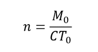  
### 3.3.3 M/T法
M/T法：这种方法综合了M法和T法各自的优势，既测量编码器脉冲数又测量一定时间内的高频脉冲数。在一个相对固定的时间内，计数编码器脉冲数M0， 并计数一个已知频率为F0的高频脉冲，计数值为M1，计算速度值。设编码器单圈总脉冲数为C，则转速n的计算公式为： 
  
## 3.4 STM32的编码器接口简介
&nbsp;&nbsp;&nbsp;&nbsp;&nbsp;&nbsp;&nbsp;&nbsp;STM32芯片内部有专门用来采集增量式编码器方波信号的接口，这些接口实际上是STM32定时器的其中一种功能。 不过编码器接口功能只有高级定时器TIM1、TIM8和通用定时器TIM2到TIM5才有。编码器接口用到了定时器的输入捕获部分,功能框图如下图所示。
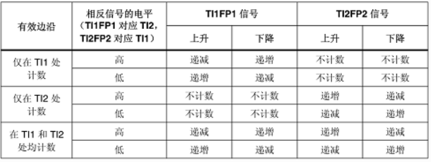
## 3.5 获取转速实验
### 3.5.1 硬件设计
&nbsp;&nbsp;&nbsp;&nbsp;&nbsp;&nbsp;&nbsp;&nbsp;所需硬件:STM32F103VET6+编码器+电机(步进/直流)+USB转TTL,串口接线和DHT11一样,电机需要转动(可以用mach3系统控制,也可以用STM其他的定时器控制)
|   STM32F103VET6   | 编码器 |
| :---------------: | :----: |
|        3.3        |  VCC   |
|        GND        |   0    |
| 编码器通道一(PA0) |   A    |
| 编码器通道二(PA1) |   B    |

### 3.5.2 软件设计
&nbsp;&nbsp;&nbsp;&nbsp;&nbsp;&nbsp;&nbsp;&nbsp;这一块比较难理解,还是需要定的基础,这里只放核心的部分代码,代码里有详细的注释,有些简单函数的说明,变量的设置,头文件的包含等并没有涉及到,完整的代码请参考Github配套的工程。
- 图3-2 发送速度函数
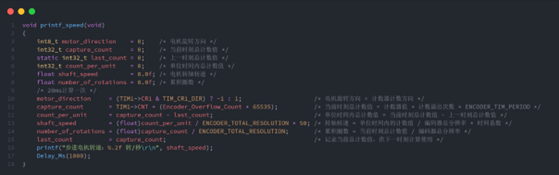 

# 4.上传华为云平台
&nbsp;&nbsp;&nbsp;&nbsp;&nbsp;&nbsp;&nbsp;&nbsp;STM32使用AT指令下发到ESP32/ESP8266进行华为云IOT平台数据上报属性
注:ESP32/ESP8266需要先烧录支持MQTT的AT固件,固件下载地:https://docs.ai-thinker.com/%E5%9B%BA%E4%BB%B6%E6%B1%87%E6%80%BB, 烧录软件推荐使用flash_download_tool(如上文件),烧录固件时需要将ESP32/ESP8266的GPIO0引脚拉低,然后点击烧录按钮,烧录完成后,将GPIO0引脚拉高,重启ESP32/ESP8266,即可使用AT指令连接华为云并上报属性
## 4.1 AT指令简介
&nbsp;&nbsp;&nbsp;&nbsp;&nbsp;&nbsp;&nbsp;&nbsp;AT命令，用来控制TE（TerminalEquipment）和MT(Mobile Terminal)之间交互的规则在物联网模块用于控制物联网模块与其他设备之间的交互规则，例如连接WiFi、连接蜂窝网络、发送数据等。在物联网应用中，AT指令可以用于控制设备的联网、数据传输等功能。
- AT指令以AT开始，以\r或者\r\n结尾，参数之间使用,隔开,字符串参数使用双引号" "包裹，整形参数不适用双引号。
## 4.2. AT指令分类
- Test 命令：AT+<x>=? 
&nbsp;&nbsp;&nbsp;&nbsp;&nbsp;&nbsp;&nbsp;&nbsp;测试指令类似于命令行里的help指令，用于提供该命令的使用信息，以及命令参数的取值范围。
- Read命令：AT+<x>? 
&nbsp;&nbsp;&nbsp;&nbsp;&nbsp;&nbsp;&nbsp;&nbsp;用于查询该指令对应功能的当前值
- Set 命令：AT+<x>=<…> 
&nbsp;&nbsp;&nbsp;&nbsp;&nbsp;&nbsp;&nbsp;&nbsp;设置用户指定的参数到对应的功能里。
- Execute 命令：AT+<x> 
&nbsp;&nbsp;&nbsp;&nbsp;&nbsp;&nbsp;&nbsp;&nbsp;执行相关操作
## 4.3 AT指令响应
- AT 标准定义了标准的响应结果字符串:
- `\r\nOK\r\n`：表示命令执行成功。
- `\r\nERROR\r\n`：表示命令执行失败。
- `\r\n+CME ERROR: <err>\r\n`：表示命令执行失败，err 为错误码。
- `\r\n+CMS ERROR: <err>\r\n`：表示命令执行失败，err 为错误码。
## 4.4.ESP32/ESP8266使用AT指令连接华为云并上报属性流程
- 1.设置模块为STA模式: 
&nbsp;&nbsp;&nbsp;&nbsp;&nbsp;&nbsp;&nbsp;&nbsp;AT+CWMODE=1
- 2.连接WIFI 
&nbsp;&nbsp;&nbsp;&nbsp;&nbsp;&nbsp;&nbsp;&nbsp;AT+CWJAP="WIFI名称","WIFI密码
- 3.设置MQTT的登陆用户名与密码 
&nbsp;&nbsp;&nbsp;&nbsp;&nbsp;&nbsp;&nbsp;&nbsp;AT+MQTTUSERCFG=0,1,"NULL","填写用户名","填写密码",0,0,""
- 4.设置MQTT的ClientID 
&nbsp;&nbsp;&nbsp;&nbsp;&nbsp;&nbsp;&nbsp;&nbsp;AT+MQTTCLIENTID=0,"填写ClientID"
- 5.设置MQTT接入地址 
&nbsp;&nbsp;&nbsp;&nbsp;&nbsp;&nbsp;&nbsp;&nbsp;AT+MQTTCONN=0,"填写MQTT接入的地址",1883,1
- 6.订阅主题 
&nbsp;&nbsp;&nbsp;&nbsp;&nbsp;&nbsp;&nbsp;&nbsp;AT+MQTTSUB=0,"订阅的主题tpoic",1
- 7.上报数据: 
&nbsp;&nbsp;&nbsp;&nbsp;&nbsp;&nbsp;&nbsp;&nbsp;AT+MQTTPUB=0," 订阅的主题tpoic ","上报的json数据",0,0
上报的json数据
## 4.5 上传华为云实验
### 4.5.1 硬件设计
所需硬件为:STM32VET6+ESP8266/32(已烧录MQTT固件)
表格4-1 接线说明
STM32VET6	ESP8266/32
GPIOA9(TX)	RXD
GPIOA10(RX)	TXD
### 4.5.2 软件设计
&nbsp;&nbsp;&nbsp;&nbsp;&nbsp;&nbsp;&nbsp;&nbsp;这是使用STM32来代替串口调试器向ESP8266/32发送AT指令,代码实现也非常简单,STM32只需要像串口发送JSON格式的AT指令即可.这里只放示例代码,有些简单函数的说明,变量的设置,头文件的包含等并没有涉及到,完整的代码请参考Github配套的工程。
- 图4-1 发送示例
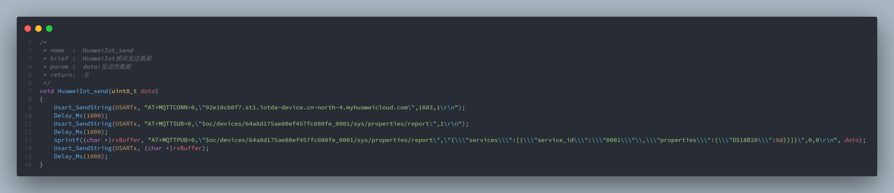
