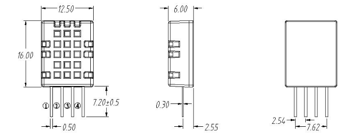

# STM32综合案例
&nbsp;&nbsp;&nbsp;&nbsp;&nbsp;&nbsp;&nbsp;&nbsp; 本项目使用STM32F10x作为主控板,使用标准库采集DHT11的温湿度,采集WCS1800的电压,采集编码器的转速,并将数据通过wifi模块上传到华为云平台.文档分为:DHT11+WCS1800+ZT3806-360-N-12-24V增量式编码器+ESP8266/32四部分,每部分从传感器的简介开始,详细介绍了传感器的各种参数,以及如何使用和使用原理,完整Github配套工程代码:(https://github.com/Abrillant-Lee/STM32)
## 1.DHT11温湿度传感器
### 1.1	DHT11简介
&nbsp;&nbsp;&nbsp;&nbsp;&nbsp;&nbsp;&nbsp;&nbsp;DHT11数字温湿度传感器是一款含有已校准数字信号输出的温湿度复合传感器。它应用专用的数字模块采集技术和温湿度传感技术，确保产品具有极高的可靠性与卓越的长期稳定性。传感器包括一个电容式感湿元件和一个NTC测温元件，并与一个高性能8位单片机相连接。
### 1.2 产品亮点
&nbsp;&nbsp;&nbsp;&nbsp;&nbsp;&nbsp;&nbsp;&nbsp;成本低、长期稳定、相对湿度和温度测量、品质卓越、超快响应、抗干扰能力强、超长的信号传输距离、数字信号输出、精确校准。
## 1.3 外形尺寸

### 1.3.1 引脚说明
&nbsp;&nbsp;&nbsp;&nbsp;&nbsp;&nbsp;&nbsp;&nbsp;VDD:供电3.3~5.5v;  
&nbsp;&nbsp;&nbsp;&nbsp;&nbsp;&nbsp;&nbsp;&nbsp;DATA串行数据,单总线;  
&nbsp;&nbsp;&nbsp;&nbsp;&nbsp;&nbsp;&nbsp;&nbsp;NC:空引脚;  
&nbsp;&nbsp;&nbsp;&nbsp;&nbsp;&nbsp;&nbsp;&nbsp;GND:接地,电源负极;  
## 1.4 产品参数
### 1.4.1 相对湿度
 
图1-2 DHT11相对湿度
1.4.2 相对温度
 
图1-3 DHT11温度性能表
1.5 串行通信说明(单线双向)
 
图1-4  DHT11单总线定义格式
1.5.1 单总线说明
DHT11器件采用简化的单总线通信。单总线即只有一根数据线，系统中的数据交换、控制均由单总线完成。设备（主机或从机）通过一个漏极开路或三态端口连至该数据线，以允许设备在不发送数据时能够释放总线，而让其它设备使用总线；单总线通常要求外接一个约4.7kΩ的上拉电阻，这样，当总线闲置时，其状态为高电平。由于它们是主从结构，只有主机呼叫从机时，从机才能应答，因此主机访问器件都必须严格遵循单总线序列，如果出现序列混乱，器件将不响应主机
1.5.2 单总线传送数据位定义
DATA用于微处理器与DHT11之间的通讯和同步,采用单总线数据格式，一次传送40位数据，高位先出。
-数据格式:
8bit湿度整数数据+8bit湿度小数数据+8bit温度整数数据+8bit温度小数数据+8bit校验位
注：其中湿度小数部分为0
1.5.3 校验位数据定义
“8bit湿度整数数据+8bit湿度小数数据+8bit温度整数数据+8bit温度小数数据”8bit校验位等于所得结果的末8位。
1.6 外设读取步骤(重要)
1.6.1 步骤一:
DHT11上电后（DHT11上电后要等待1S以越过不稳定状态在此期间不能发送任何指令），测试环境温湿度数据，并记录数据，同时DHT11的DATA数据线由上拉电阻拉高一直保持高电平；此时DHT11的DATA引脚处于输入状态，时刻检测外部信号。
1.6.2 步骤二:
微处理器的I/O设置为输出同时输出低电平，且低电平保持时间不能小于18ms（最大不得超过30ms），然后微处理器的I/O设置为输入状态，由于上拉电阻，微处理器的I/O即DHT11的DATA数据线也随之变高，等待DHT11作出回答信号。发送信号如下图所示：
 
图1-5 主机发送起始信号
1.6.3 步骤三: 
DHT11的DATA引脚检测到外部信号有低电平时，等待外部信号低电平结束，延迟后DHT11的DATA引脚处于输出状态，输出83微秒的低电平作为应答信号，紧接着输出87微秒的高电平通知外设准备接收数据，微处理器的I/O此时处于输入状态，检测到I/O有低电平（DHT11回应信号）后，等待87微秒的高电平后的数据接收，发送信号如图所示：
 
图1-6 从机响应信号
1.6.4 步骤四:
由DHT11的DATA引脚输出40位数据，微处理器根据I/O电平的变化接收40位数据，位数据“0”的格式为：54微秒的低电平和23-27微秒的高电平，位数据“1”的格式为：54微秒的低电平加68-74微秒的高电平。位数据“0”、“1”格式信号如图所示：
 
图1-7 数据格式
1.6.5 结束信号:
DHT11的DATA引脚输出40位数据后，继续输出低电平54微秒后转为输入状态，由于上拉电阻随之变为高电平。但DHT11内部重测环境温湿度数据，并记录数据，等待外部信号的到来。
注: 每次读出的温湿度数值是上一次测量的结果，欲获取实时数据,需连续读取2次，但不建议连续多次读取传感器，每次读取传感器间隔大于2秒即可获得准确的数据
1.7 DHT11获取温湿度实验
1.7.1硬件设计
为实现STM32获取DHT11温湿度传感器数据并将数据打印在串口上,后续上传到华为云平台,需要准备STM32VET6+DHT11+USB转TTL.
表1-1 接线说明
STM32VET6	DHT11	UBS转TTL
3.3v	VCC	可接/可不接
GND	GND	GND
GPIOE6(可改宏定义进行改变)	DATA	无
PA9	无	RXD
PA10	无	TXD

1.7.2软件设计
写程序时对照着1.6外设读取步骤配置,这里只放核心的部分代码,代码里有详细的注释,看注释即可明白,有些简单函数的说明,变量的设置,头文件的包含等并没有涉及到,完整的代码请参考Github配套的工程。
 
图1-8 DHT11读取一个字节函数
 
图1-9 读取温湿度函数

# 2.电流互感器/WCS1800霍尔电流传感器

# 3.编码器

# 4.上传华为云平台
